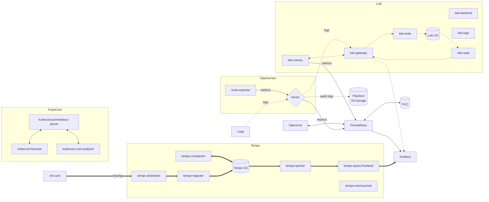

# Medic Observability

## Chart

### Simplified ASCII chart
```
┌─Legend─────┐
│            │
│ ─▶ Metrics │
│            │
│ ═▷ Logs    │                 ┌────────┐
│            │                 │OpenCost│
└────────────┘                 └──▲┬────┘
                              ┌───┴▼─────┐
                         ┌────▶Prometheus├───┐
┌ Daemonset ─ ─ ─ ─ ─ ─ ─│─ ┐ └──────────┘   │
  ┌─────────────┐  ┌─────┴┐              ┌───▼───┐
│ │node-exporter├──▶Vector│ │            │Grafana│
  └─────────────┘  └─△───╦┘              └───△───┘
└ ─ ─ ─ ─ ─ ─ ─ ─ ─ ─║─ ─║─ ┘ ┌──────────┐   ║
             ┌───────╩─┐ ╚════▷   Loki   ╠═══╝
             │Node logs│      └──────────┘    
             └─────────┘   
                          
```

## Components

### [OpenCost](https://www.opencost.io/)
Exports cost metrics to Prometheus for analyzing Kubernetes resource costs and efficiencies
### [Vector](https://vector.dev/)
Collects, transforms, and routes observability data (logs and metrics)
### [Prometheus](https://prometheus.io/docs/introduction/overview/)
Monitors targets by scraping metrics
### [node-exporter](https://github.com/prometheus/node_exporter)
Provides system-level metrics to Prometheus for monitoring hardware and OS details.
Metrics are forwarded to prometheus through vector instead of crawled directly since the EKS CNI in use does not support direct connections to DaemonSets without hostNetwork
### [Grafana](https://grafana.com/)
Visualizes data from various sources, including Prometheus and Loki, for dashboards and logs
### [kube-state-metrics](https://github.com/kubernetes/kube-state-metrics)
Listens to the Kubernetes API server and generates metrics about the state of the objects

## Grafana
### Adding new dashboards
There's two different ways to add a dashboard
#### _Option 1:_ Package with observability helm-chart
Export the json and add it in `dashboards/{medic,thirdparty}`
#### _Option 2:_ Package with application helm-chart
Add the dashboard as a configmap and set label `grafana_dashboard=medic-observability`
